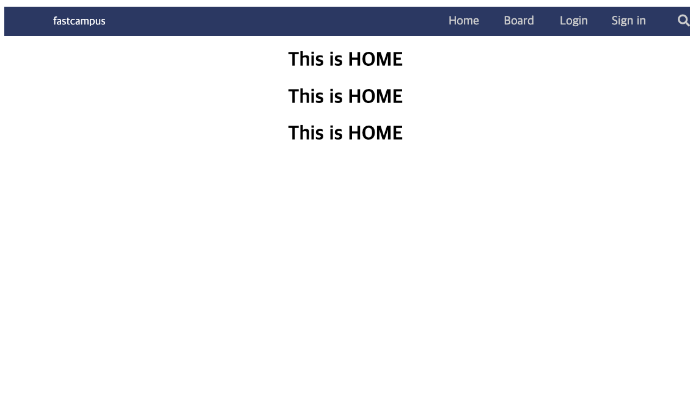
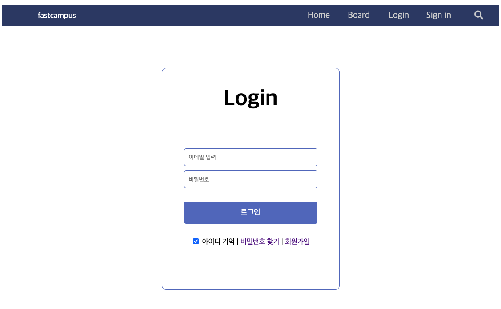
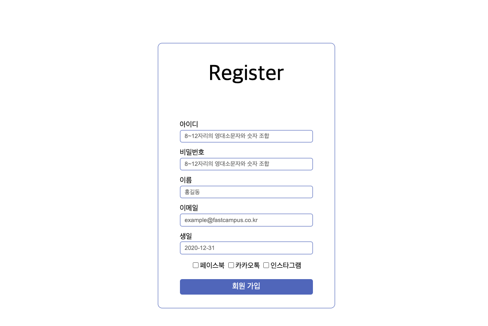
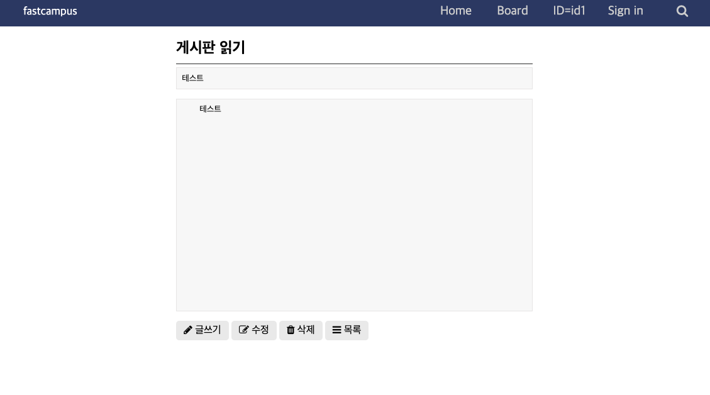
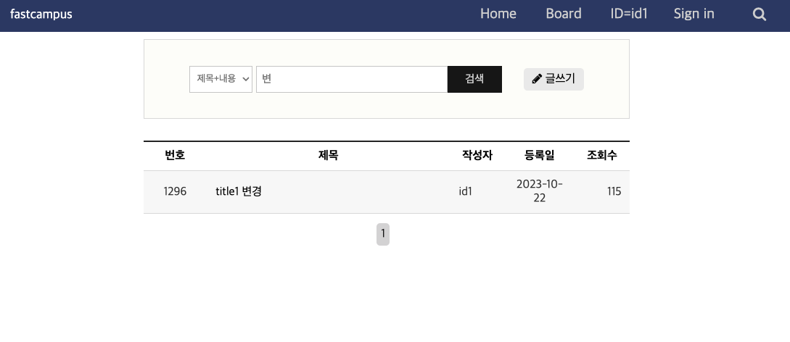
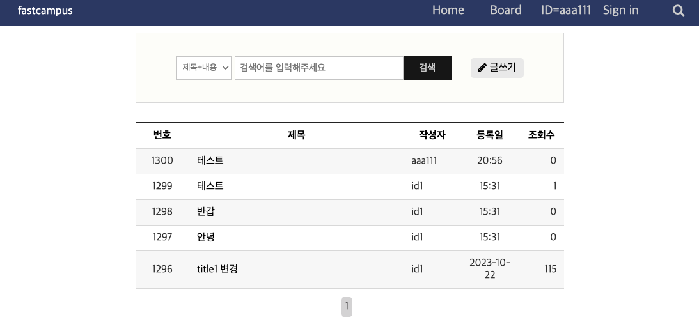

# 기본 CRUD 게시판 프로젝트

<h2>사이트 구성</h2>

 회원가입 , 로그인 , 게시판 관리 기능이 포함된 기본 사이트 입니다. 
JAVA 언어 기반으로 MySQL 데이터베이스를 이용하여 Spring으로 구현하였습니다. 

<h2>ERD</h2>
<h3>회원</h3>

<h3>게시판</h3>

<h3>댓글</h3>

<h2> 화면 </h2>
<h3>home</h3>

<h3>로그인 | 회원가입 </h3>

<h3>게시판 | 글쓰기 , 삭제 , 수정 , 검색 </h3>

